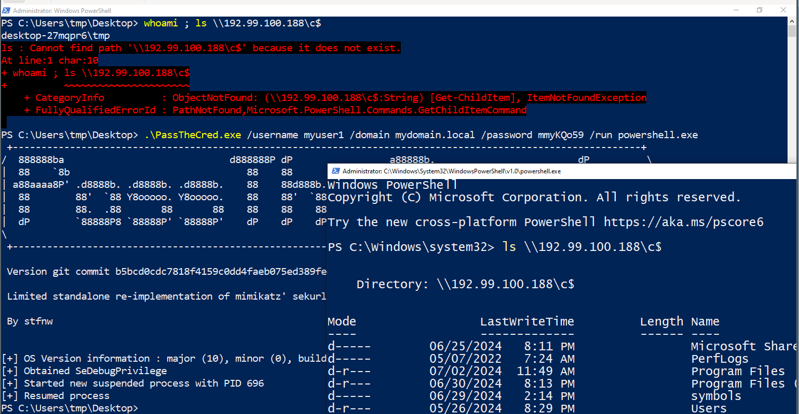
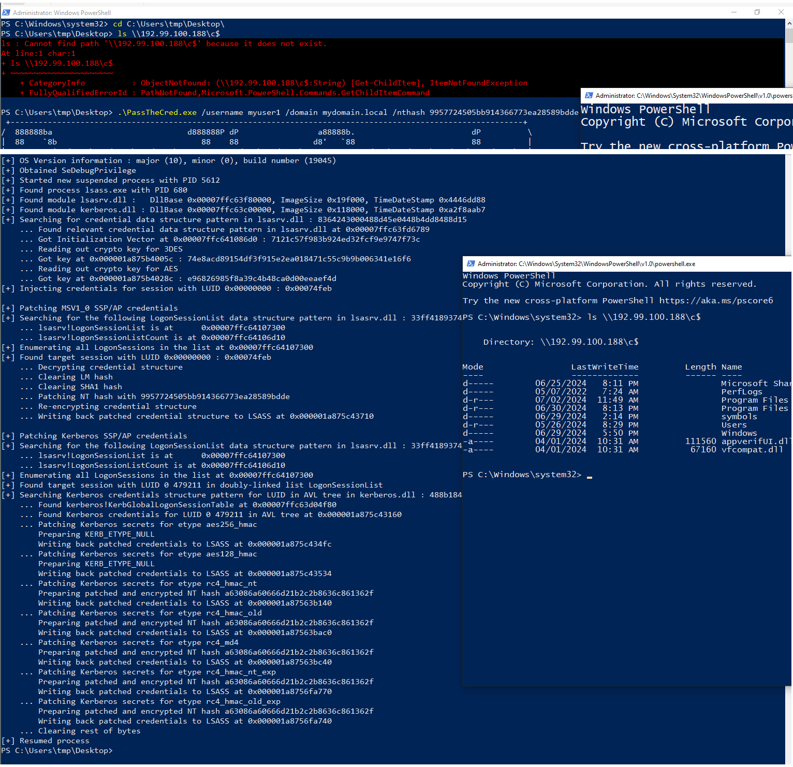
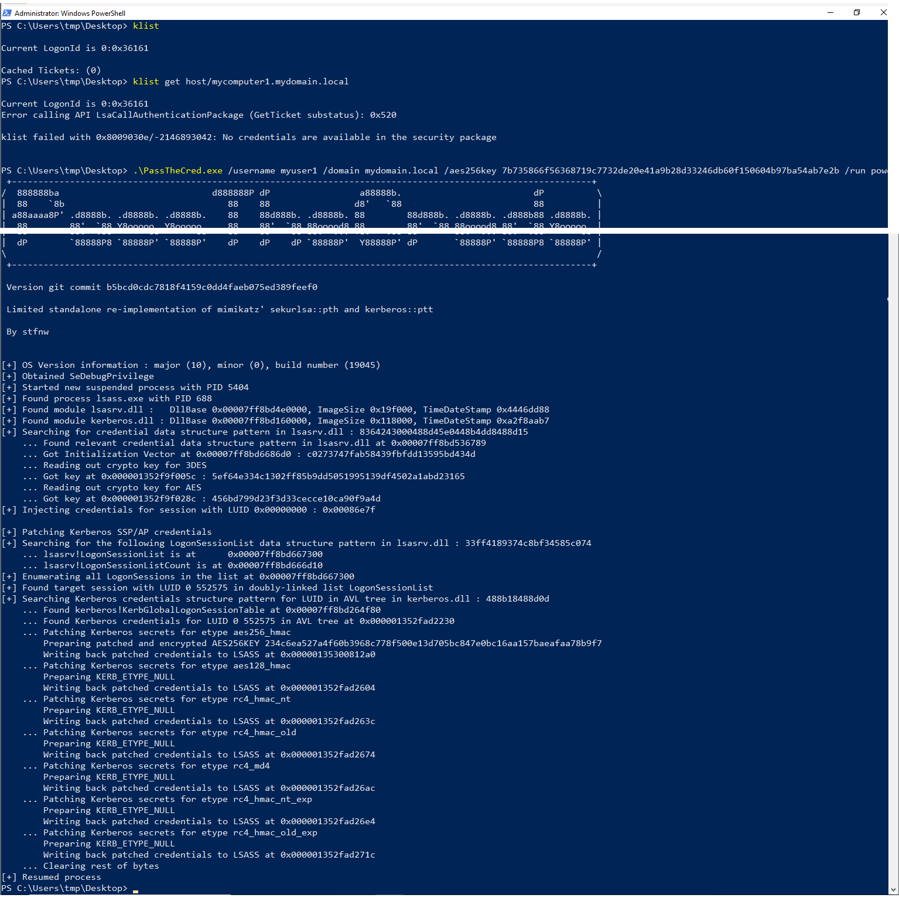
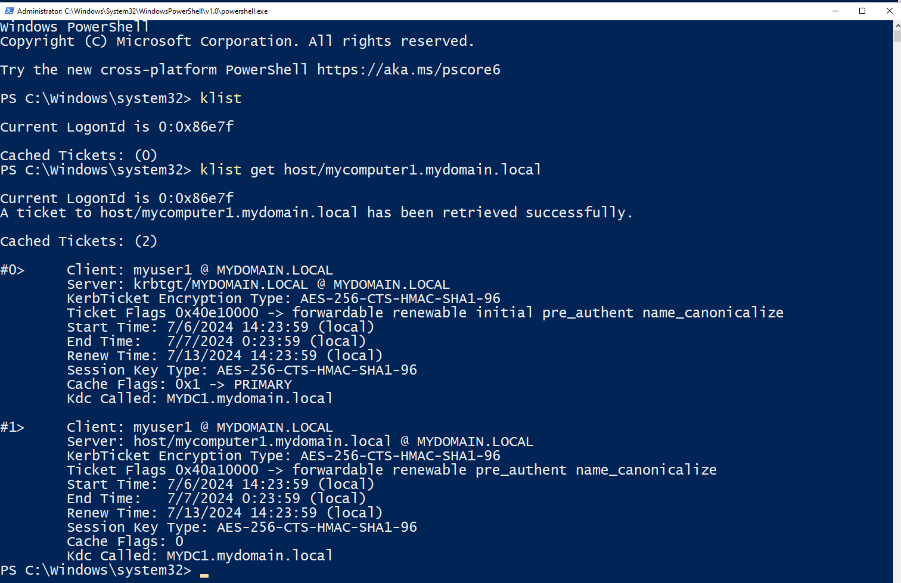
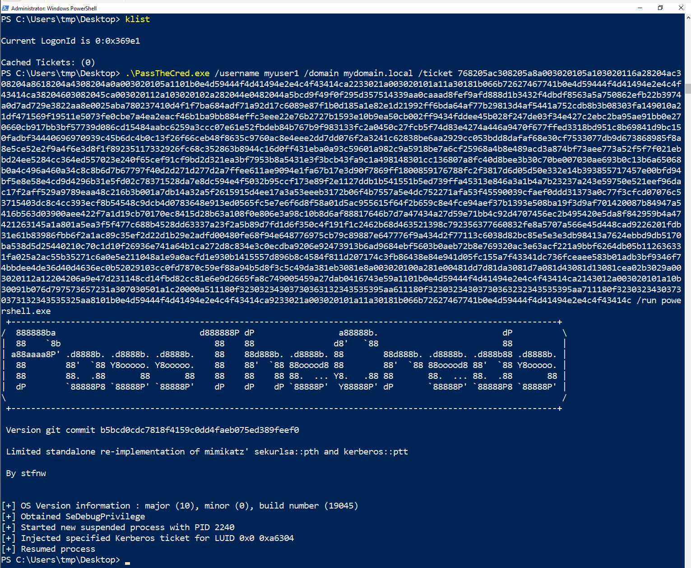
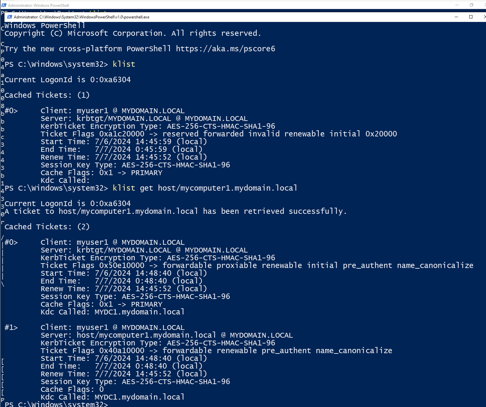

# [PassTheCred](https://github.com/stfnw/PassTheCred)

Standalone, commented re-implementation of injecting ("passing") various Windows credentials into the LSASS memory for network authentication.
Code is adapted from mimikatz.


# Why? When to use this?

For educational purposes; mostly for myself as a learning exercise to better understand how mimikatz works.
DO NOT USE THIS ON MACHINES YOU CARE ABOUT; only on machines that are allowed to crash!
This code is meant to be read; it serves mainly as an in-time snapshot and will not be developed further.
In the real world, just use Mimikatz and/or Rubeus directly, which provide a better and more complete implementation.


# What this project does

This project re-implements a very limited subset of [Benjamin DELPY's great mimikatz'](https://github.com/gentilkiwi/mimikatz) (not affiliated) functionality of `sekurlsa::pth` and `kerberos::ptt` in a standalone tool.
[Commit 0c611b1445b22327fcc7defab2c09b63b4f59804](https://github.com/gentilkiwi/mimikatz/tree/0c611b1445b22327fcc7defab2c09b63b4f59804) acts as basis for any references to Mimikatz' code.

The code was taken from mimikatz and then refactored and each step commented for easier readability.
Since this tool only implements `pth` / `ptt`, it was possible to take some shortcuts and consolidate some functionality that is split in mimikatz for purpose of reuse in other mimikatz modules.
This allowed for a simpler software architecture.

Some limitations in comparison to the full mimikatz' `pth` and `ptt` implementations are that it only runs on 64bit Windows.
Also, it was only tested on Windows 10 Pro (Build 19045).
<!-- I tried to guard all code paths from mimikatz that are not implemented with checks; ideally this tool gives clear indication on whether the current system it runs on is supported or not (i.e. if the tool runs, the behavior should be correct; no silent failure). -->

This tool is able to create a new process and inject various credentials into the memory of the LSASS process for that newly created process context.
These credentials are then subsequently used for network authentication of all network resource accesses undertaken by the process.
Injecting credentials in [the two main](https://learn.microsoft.com/en-us/windows/win32/secauthn/authentication-packages-provided-by-microsoft) [security support provider/authentication packages (SSP/AP)](https://learn.microsoft.com/en-us/windows/win32/secauthn/windows-authentication-packages) MSV1_0 (LM/NTLM network authentication) and Kerberos (Kerberos network authentication) is supported.

More specifically the following credentials can be re-used:

- plaintext username/password (not really injecting anything, essentially `runas /netonly` while allowing non-interactive specification of the password on the commandline)

- [MSV1_0 SSP/AP](https://learn.microsoft.com/en-us/windows/win32/secauthn/msv1-0-authentication-package)
    - LM password hash (*pass-the-hash*)
    - NT password hash (`sekurlsa::pth`, *pass-the-hash*)
    - SHA1 password hash (?)

- [Kerberos SSP/AP](https://learn.microsoft.com/en-us/windows/win32/secauthn/kerberos-ssp-ap):
    - Kerberos secrets (`sekurlsa::pth`, NT hash / AES128 key / AES256 key, enables Kerberos SSP/AP to subsequently request tickets (TGT/ST) with these secrets, *overpass-the-hash* / *pass-the-key*)
    - Kerberos tickets (`kerberos::ptt`, in kirbi format, both ticket granting tickets (TGT) and service tickets (ST) should work, *pass-the-ticket*)

This tools also allows setting LM and SHA1 hashes inside MSV1_0.
This functionality is not exposed to the user by Mimikatz.
LM hashes: likely because LM network authentication already has been hopelessly out of date since ages ago and therefore is not relevant anymore.
SHA1 hashes: I don't really know the role they play in MSV1_0; at least they are not used for network authentication and therefore irrelevant in the context of pass-the-hash.

A note on stability: currently injecting into Kerberos SSP/AP seems to work in principle, but nonetheless breaks something in LSASS which causes the system to reboot after a few minutes; I think I got some offsets wrong, also see [this comment in the source code](PassTheCred.c#L1704).


# What this project doesn't do?

This tool can only use/inject *existing* credentials.
Everything it does happens locally on the computer the program is running on.
It does not cause network traffic or interact with the network at all.
It is for example unable to authenticate using a certificate / PFX file, since this happens via PKINIT, during which a Kerberos TGT is requested over the network, or via Schannel.
For that use [`rubeus /asktgt`](https://github.com/GhostPack/Rubeus#asktgt) or [`gettgtpkinit.py`](https://github.com/dirkjanm/PKINITtools#gettgtpkinitpy) or [`certipy auth`](https://github.com/ly4k/Certipy#authenticate).
The resulting TGT can then be dumped using Mimikatz or Rubeus, and *then* this tool could be used to inject that ticket and start a new process in the given user context.


# How to run

Get releases from [the release page](../../releases) or [build the project](#how-to-build).


# How to use

[See the `PrintUsage` function in the code](PassTheCred.c#L204) or [the examples](#example-usage).


# Example usage

For the sake of the following demonstrations we assume two windows VMs in a lab setting:
We inject credentials of the domain user `MYDOMAIN.LOCAL\MYUSER1` into memory on `DESKTOP-27MQPR6` (Windows 10 Pro Build 19045; not domain joined).
Then we access the C$ SMB network share on `MYCOMPUTER1.MYDOMAIN.LOCAL` (192.99.100.188; Windows 11; domain joined; `MYUSER1` is local admin there).


## /password

```
.\PassTheCred.exe /username myuser1 /domain mydomain.local /password mmyKQo59 /run powershell.exe
ls \\192.99.100.188\c$
```




## /nthash

```
.\PassTheCred.exe /username myuser1 /domain mydomain.local /nthash 9957724505bb914366773ea28589bdde /run powershell.exe
# demonstrate pass-the-hash
ls \\192.99.100.188\c$
```




## /aes256key

```
.\PassTheCred.exe /username myuser1 /domain mydomain.local /aes256key 7b735866f56368719c7732de20e41a9b28d33246db60f150604b97ba54ab7e2b /run powershell.exe
# demonstrate overpass-the-hash
klist get host/mycomputer1.mydomain.local
```






## /ticket

```
.\PassTheCred.exe /username myuser1 /domain mydomain.local /ticket 768205ac308205a8a003020105a103020116a28204ac308204a8618204a4308204a0a003020105a1101b0e4d59444f4d41494e2e4c4f43414ca2233021a003020101a11a30181b066b72627467741b0e4d59444f4d41494e2e4c4f43414ca38204603082045ca003020112a103020102a282044e0482044a5bcd9f49f0f295d357514339aa0caaad8fef9afd888d1b3432f4dbdf8563a5a750862efb22b3974a0d7ad729e3822aa8e0025aba780237410d4f1f7ba684adf71a92d17c6089e87f1b0d185a1e82e1d21992ff6bda64af77b29813d4af5441a752cdb8b3b08303fa149010a21df471569f19511e5073fe0cbe7a4ea2eacf46b1ba9bb884effc3eee22e76b2727b1593e10b9ea50cb002ff9434fddee45b028f247de03f34e427c2ebc2ba95ae91bb0e270660cb917bb3bf57739d086cd15484aabc6259a3ccc07e61e52fbdeb84b767b9f983133fc2a0450c27fcb5f74d83e4274a446a9470f677ffed3318bd951c8b69841d9bc150fadbf34440696970939c45b6dc4b0c13f26f66ceb48f8635c9760ac8e4eee2dd7dd076f2a3241c62838be6aa2929cc053bdd8dafaf68e30cf7533077db9d673868985f8a8e5ce52e2f9a4f6e3d8f1f89235117332926fc68c352863b8944c16d0ff431eba0a93c59601a982c9a5918be7a6cf25968a4b8e489acd3a874bf73aee773a52f5f7f021ebbd24ee5284cc364ed557023e240f65cef91cf9bd2d321ea3bf7953b8a5431e3f3bcb43fa9c1a498148301cc136807a8fc40d8bee3b30c70be007030ae693b0c13b6a65068b0a4c496a460a34c8c8b6d7b67797f40d2d271d277d2a7ffee611ae9094e1fa67b17e3d90f7869ff1800859176788fc2f3817d6d05d50e332e14b393855717457e00bfd94bf5e8e58e4cd9d4296b31e5fd02c78371528da7e8dc594e4f5032b95ccf173e89f2e1127ddb1b541551b5ed739ffa45313e846a3a1b4a7b23237a243e59750e521eef96dac17f2aff529a9789eaa48c216b3b001a7db14a32a5f2615915d4ee17a3a53eeeb3172b06f4b7557a5e4dc752271afa53f45590039cfaef0ddd31373a0c77f3cfcd07076c53715403dc8c4cc393ecf8b54548c9dcb4d0783648e913ed0565fc5e7e6f6d8f58a01d5ac955615f64f2b659c8e4fce94aef37b1393e508ba19f3d9af701420087b84947a5416b563d03900aee422f7a1d19cb70170ec8415d28b63a108f0e806e3a98c10b8d6af88817646b7d7a47434a27d59e71bb4c92d4707456ec2b495420e5da8f842959b4a47421263145a1a801a5ea3f5f477c688b4528dd63337a23f2a5b89d7fd1d6f350c4f191f1c2462b68d463521398c792356377660832fe8a5707a566e45d448cad9226201fdb31e61b83986fbb6f2a1ac89c35ef2d22d1b29e2adfd00480fe68f94e648776975cb79c89887e647776f9a434d2f77113c6038d82bc85e5e3e3db98413a7624ebbd9db5170ba538d5d25440210c70c1d10f26936e741a64b1ca272d8c834e3c0ecdba9206e92473913b6ad9684ebf5603b0aeb72b8e769320ac3e63acf221a9bbf6264db05b112636331fa025a2ac55b35271c6a0e5e211048a1e9a0acfd1e930b1415557d896b8c4584f811d207174c3fb86438e84e941d05fc155a7f43341dc736fceaee583b01adb3bf9346f74bbdee4de36d40d4636ec0b52029103cc0fd7870c59ef88a94b5d8f3c5c49da381eb3081e8a003020100a281e00481dd7d81da3081d7a081d43081d13081cea02b3029a003020112a12204206a9e47d231148cd14fbd82cc81e6e9d2665fa8c749005459a27dab0416743e59a1101b0e4d59444f4d41494e2e4c4f43414ca2143012a003020101a10b30091b076d797573657231a307030501a1c20000a511180f32303234303730363132343535395aa611180f32303234303730363232343535395aa711180f32303234303730373132343535325aa8101b0e4d59444f4d41494e2e4c4f43414ca9233021a003020101a11a30181b066b72627467741b0e4d59444f4d41494e2e4c4f43414c /run powershell.exe
klist get host/mycomputer1.mydomain.local
```






# How to build

The project can be built on linux with a simple invocation of:

```shell
$ git clone https://github.com/stfnw/PassTheCred
$ cd PassTheCred

$ make
x86_64-w64-mingw32-gcc -Wextra -Wall -Wpedantic -municode -DPASS_THE_CRED_GIT_COMMIT=\"edc43296174026beaec681c4462f432eecfcce23\" -o PassTheCred.o -c PassTheCred.c
x86_64-w64-mingw32-gcc -Wextra -Wall -Wpedantic -municode -DPASS_THE_CRED_GIT_COMMIT=\"edc43296174026beaec681c4462f432eecfcce23\" -o PassTheCred.exe PassTheCred.o -lntdll -lbcrypt -lsecur32
rm PassTheCred.o
```

Besides `build-essential`, the only dependencies are `git` and `mingw-w64`.
[The Dockerfile](Dockerfile) codifies the build process and dependencies.


# Credits and License

Since the original code was taken from mimikatz I chose to place this program under the same license:
CC BY 4.0 licence - https://creativecommons.org/licenses/by/4.0/.


# Other helpful links and references

Besides the [source code of mimikatz](https://github.com/gentilkiwi/mimikatz), [pypykatz](https://github.com/skelsec/pypykatz) and [Rubeus](https://github.com/GhostPack/Rubeus), and the mentioned Microsoft documentation, the following resources were useful in understanding more of the functionality:

- https://www.praetorian.com/blog/inside-mimikatz-part1/

- https://www.praetorian.com/blog/inside-mimikatz-part2/

- https://powerseb.github.io/posts/LSASS-parsing-without-a-cat/

- https://learn.microsoft.com/en-us/windows-server/security/windows-authentication/credentials-processes-in-windows-authentication


# Conclusion

I learned a lot throughout this project, reading the source code of mimikatz and various documentation.

What I absolutely did not expect was the difference in complexity of pass-the-hash vs pass-the-ticket:
Pass-the-hash requires manually walking and binary patching the various data structures in the memory of the LSASS process.
Pass-the-ticket on the other hand, just calls an existing API function of the Kerberos authentication package to submit the ticket; [its implementation is only a few lines](PassTheCred.c#L1772).

Furthermore, I also did not expect that pass-the-hash actually in turn requires implementing a good chunk of the crypto involved in dumping LSASS secrets -- at least the crypto for the relevant SSP/APs MSV1_0 and Kerberos --, further increasing the needed complexity.
This is necessary since the relevant credentials that need to be patched are of course only available in protected form in memory, therefore requiring decryption before patching, and also re-encryption afterwards.
In hindsight this is obvious.
